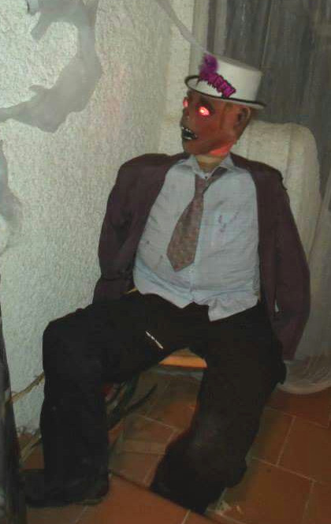

# Headlloween

This project is a Halloween decoration consisting of a doll that moves its head.

The board used is an Arduino nano (for space reasons), but any other can be used.

It's a simply program: read a sensor and if movement it's detected then move a servo for the neck and blink some leds for the eyes.